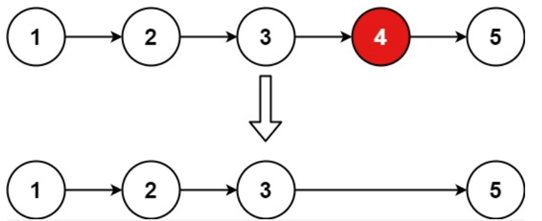

## 题目

19.[删除链表的倒数第N个节点](https://leetcode-cn.com/problems/remove-nth-node-from-end-of-list/)

给你一个链表，删除链表的倒数第 n 个结点，并且返回链表的头结点。

进阶：你能尝试使用一趟扫描实现吗？

示例 1：



```
输入：head = [1,2,3,4,5], n = 2
输出：[1,2,3,5]
```

示例 2：

```
输入：head = [1], n = 1
输出：[]
```

示例 3：

```
输入：head = [1,2], n = 1
输出：[1]
```


## 解答

#### C++语言

```C++
/**
 * Definition for singly-linked list.
 * struct ListNode {
 *     int val;
 *     ListNode *next;
 *     ListNode() : val(0), next(nullptr) {}
 *     ListNode(int x) : val(x), next(nullptr) {}
 *     ListNode(int x, ListNode *next) : val(x), next(next) {}
 * };
 */
class Solution {
public:
    ListNode* removeNthFromEnd(ListNode* head, int n) {
        ListNode* dummyHead = new ListNode(0);
        dummyHead->next = head;
        ListNode* slow = dummyHead;
        ListNode* fast = dummyHead;
        for(int i=0; i<=n && fast!=nullptr; ++i){
            fast=fast->next;
        }
        // while(n-- && fast != NULL) {
        //     fast = fast->next;
        // }
        // fast = fast->next; // fast再提前走一步，因为需要让slow指向删除节点的上一个节点
        while (fast != NULL) {
            fast = fast->next;
            slow = slow->next;
        }
        slow->next = slow->next->next;
        return dummyHead->next;
        
    }
};
```

#### C语言

```C
/**
 * Definition for singly-linked list.
 * struct ListNode {
 *     int val;
 *     struct ListNode *next;
 * };
 */

struct ListNode* removeNthFromEnd(struct ListNode* head, int n){
    if(head==NULL) return head;

    struct ListNode *dummpyNode = (struct ListNode *)malloc(sizeof(struct ListNode));
    dummpyNode->val=-1;
    dummpyNode->next = head;

    struct ListNode *slow = dummpyNode;
    struct ListNode *fast = dummpyNode;

    int i=0;
    for(;i<=n && fast!=NULL; ++i){
        fast=fast->next;
    }
    
    while(fast!=NULL){
        slow=slow->next;
        fast=fast->next;
    }
    // printf("%d\n", slow->val);
    // printf("%d\n", fast->val);

    if(slow->next!=NULL){
        struct ListNode *tmp=slow->next;
        
        slow->next=slow->next->next;
        free(tmp);
    }

    return dummpyNode->next;
}
```

