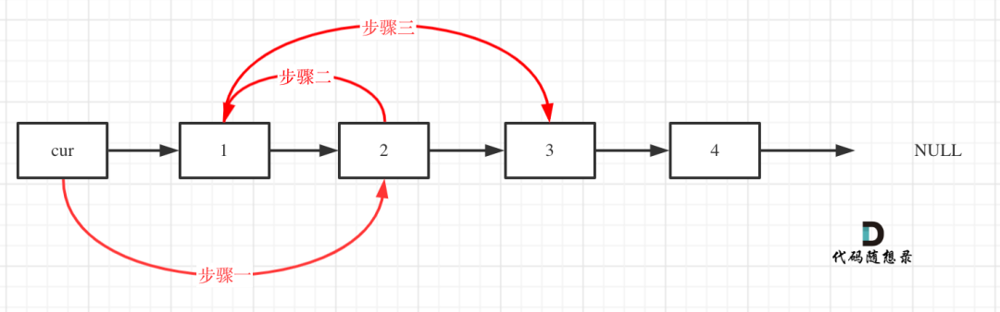
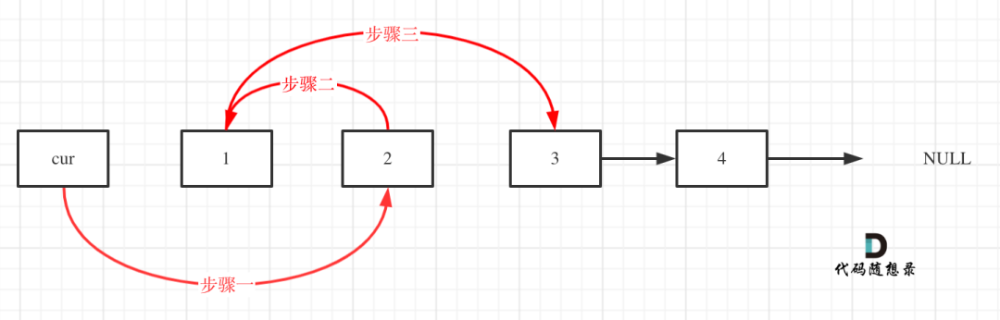
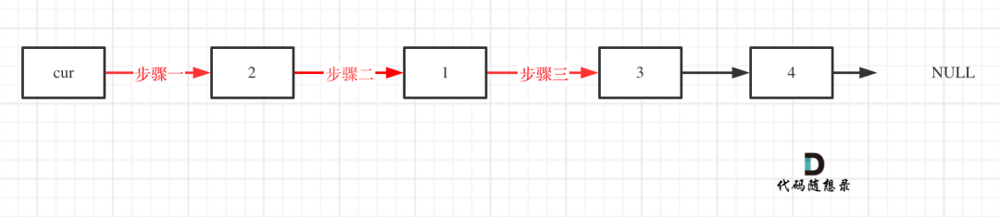

## 题目

[24. 两两交换链表中的节点](https://leetcode-cn.com/problems/swap-nodes-in-pairs/)

给定一个链表，两两交换其中相邻的节点，并返回交换后的链表。

**你不能只是单纯的改变节点内部的值**，而是需要实际的进行节点交换。

 

**示例 1：**


```
输入：head = [1,2,3,4]
输出：[2,1,4,3]
```

**示例 2：**

```
输入：head = []
输出：[]
```

**示例 3：**

```
输入：head = [1]
输出：[1]
```

 

**提示：**

- 链表中节点的数目在范围 `[0, 100]` 内
- `0 <= Node.val <= 100`

 

**进阶：**你能在不修改链表节点值的情况下解决这个问题吗?（也就是说，仅修改节点本身。）


## 解答

初始时，cur指向虚拟头结点，然后进行如下三步：



操作之后，链表如下：



看这个可能就更直观一些了：




```C++
/**
 * Definition for singly-linked list.
 * struct ListNode {
 *     int val;
 *     ListNode *next;
 *     ListNode() : val(0), next(nullptr) {}
 *     ListNode(int x) : val(x), next(nullptr) {}
 *     ListNode(int x, ListNode *next) : val(x), next(next) {}
 * };
 */

class Solution {
public:
    ListNode* swapPairs(ListNode* head) {
        ListNode *dummyHead = new ListNode(0); //虚拟头结点
        dummyHead->next = head;
        ListNode *curNode=dummyHead;
        while(curNode->next!=nullptr && curNode->next->next!=nullptr){
            ListNode *tmpNode = curNode->next;
            ListNode *nextNode = curNode->next->next->next;

            curNode->next = curNode->next->next;
            curNode->next->next = tmpNode;
            curNode->next->next->next = nextNode;

            curNode=curNode->next->next;

        }
        return dummyHead->next;
    }
    
};

// 反转k个一组的节点
// class Solution {
// public:
//     ListNode *reverse(ListNode *aNode, ListNode *bNode){
//         ListNode *pre=nullptr;
//         ListNode *curNode=aNode;

//         while(curNode!=bNode){
//             ListNode *nextNode = curNode->next;
//             curNode->next=pre;

//             pre=curNode;
//             curNode=nextNode;
//         }

//         return pre;
//     }
//     ListNode *reverseKGroup(ListNode *curNode, int k){
//         if(curNode==nullptr){
//             return curNode;
//         }
//         ListNode *aNode = curNode;
//         ListNode *bNode = curNode;

//         for(int i=0; i<k; ++i){
//             if(bNode==nullptr){
//                 return curNode;
//             }
//             bNode=bNode->next;
//         }
//         ListNode *newHead = reverse(aNode, bNode);
//         aNode->next= reverseKGroup(bNode, k);
        
//         return newHead;
//     }
//     ListNode* swapPairs(ListNode* head) {
//         return reverseKGroup(head, 2);
//     }
// };


// 自解答
// class Solution {
// public:
//     ListNode* swapPairs(ListNode* head) {
//         if (head == nullptr) {
// 			return nullptr;
// 		}

// 		ListNode *curNode = head;
// 		ListNode *nextNode = head;
// 		if (curNode->next != nullptr) {
// 			curNode = curNode->next;
// 			head = curNode;
// 		}else {
// 			return head;
// 		}
		
// 		ListNode *preNode = nullptr;
		

// 		while (curNode) {
// 			ListNode *tmp = curNode->next;
			
// 			nextNode->next = curNode->next;
// 			curNode->next = nextNode;
// 			preNode = nextNode;

// 			curNode = nextNode = tmp;
			
// 			if (curNode) {
// 				curNode = curNode->next;
// 			}
// 			if (curNode && preNode != nullptr) {
// 				preNode->next = curNode;
// 			}
// 		}

// 		return head;
//     }
// };
```

