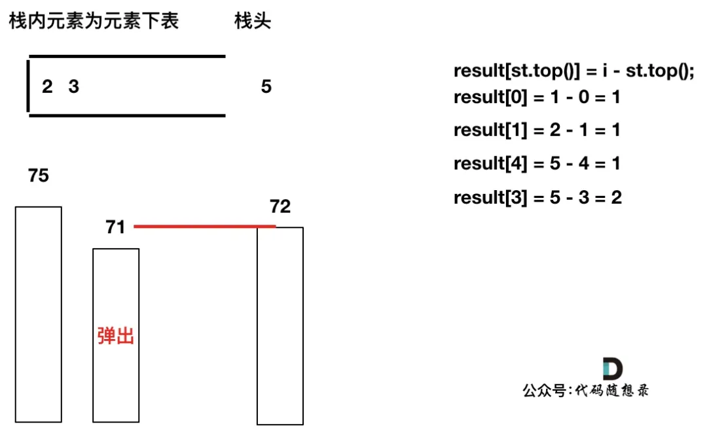

### 


## [739. 每日温度](https://leetcode-cn.com/problems/daily-temperatures/)

### 题目

请根据每日 `气温` 列表，重新生成一个列表。对应位置的输出为：要想观测到更高的气温，至少需要等待的天数。如果气温在这之后都不会升高，请在该位置用 `0` 来代替。

例如，给定一个列表 `temperatures = [73, 74, 75, 71, 69, 72, 76, 73]`，你的输出应该是 `[1, 1, 4, 2, 1, 1, 0, 0]`。

**提示：**`气温` 列表长度的范围是 `[1, 30000]`。每个气温的值的均为华氏度，都是在 `[30, 100]` 范围内的整数。


### 解答

**什么是单调栈？**

就是栈里的元素保持升序或者降序。


怎么能想到用单调栈呢？什么时候用单调栈呢？

**通常是一维数组，要寻找任一个元素的右边或者左边第一个比自己大或者小的元素的位置，此时我们就要想到可以用单调栈了**。

在使用单调栈的时候首先要明确如下几点：

1. 单调栈里存放的元素是什么？

单调栈里只需要存放元素的下标i就可以了，如果需要使用对应的元素，直接T[i]就可以获取。

2. 单调栈里元素是递增呢？还是递减呢？

**注意一下顺序为 从栈头到栈底的顺序**，因为单纯的说从左到右或者从前到后，不说栈头朝哪个方向的话，大家一定会越看越懵。

这里我们要使用递增循序（再强调一下是指从栈头到栈底的顺序），因为只有递增的时候，加入一个元素i，才知道栈顶元素在数组中右面第一个比栈顶元素大的元素是i。

文字描述理解起来有点费劲，接下来我画了一系列的图，来讲解单调栈的工作过程。

使用单调栈主要有三个判断条件。

- 当前遍历的元素T[i]小于栈顶元素T[st.top()]的情况
- 当前遍历的元素T[i]等于栈顶元素T[st.top()]的情况
- 当前遍历的元素T[i]大于栈顶元素T[st.top()]的情况

**把这三种情况分析清楚了，也就理解透彻了**。

接下来我们用temperatures = [73, 74, 75, 71, 71, 72, 76, 73]为例来逐步分析，输出应该是 [1, 1, 4, 2, 1, 1, 0, 0]。

首先先将第一个遍历元素加入单调栈



加入T[1] = 74，因为T[1] > T[0]（当前遍历的元素T[i]大于栈顶元素T[st.top()]的情况），而我们要保持一个递增单调栈（从栈头到栈底），所以将T[0]弹出，T[1]加入，此时result数组可以记录了，result[0] = 1，即T[0]右面第一个比T[0]大的元素是T[1]。


加入T[2]，同理，T[1]弹出


加入T[3]，T[3] < T[2] （当前遍历的元素T[i]小于栈顶元素T[st.top()]的情况），加T[3]加入单调栈。


加入T[4]，T[4] == T[3] （当前遍历的元素T[i]等于栈顶元素T[st.top()]的情况），此时依然要加入栈，不用计算距离，因为我们要求的是右面第一个大于本元素的位置，而不是大于等于

！

加入T[5]，T[5] > T[4] （当前遍历的元素T[i]大于栈顶元素T[st.top()]的情况），将T[4]弹出，同时计算距离，更新result


T[4]弹出之后， T[5] > T[3] （当前遍历的元素T[i]大于栈顶元素T[st.top()]的情况），将T[3]继续弹出，同时计算距离，更新result


直到发现T[5]小于T[st.top()]，终止弹出，将T[5]加入单调栈


加入T[6]，同理，需要将栈里的T[5]，T[2]弹出


同理，继续弹出


此时栈里只剩下了T[6]

加入T[7]， T[7] < T[6] 直接入栈，这就是最后的情况，result数组也更新完了。


此时有同学可能就疑惑了，那result[6] , result[7]怎么没更新啊，元素也一直在栈里。

其实定义result数组的时候，就应该直接初始化为0，如果result没有更新，说明这个元素右面没有更大的了，也就是为0。

以上在图解的时候，已经把，这三种情况都做了详细的分析。

- 情况一：当前遍历的元素T[i]小于栈顶元素T[st.top()]的情况
- 情况二：当前遍历的元素T[i]等于栈顶元素T[st.top()]的情况
- 情况三：当前遍历的元素T[i]大于栈顶元素T[st.top()]的情况

```C++
// 版本一
class Solution {
public:
    vector<int> dailyTemperatures(vector<int>& T) {
        // 递减栈
        stack<int> st;
        vector<int> result(T.size(), 0);
        st.push(0);
        for (int i = 1; i < T.size(); i++) {
            if (T[i] < T[st.top()]) {                       // 情况一
                st.push(i);
            } else if (T[i] == T[st.top()]) {               // 情况二
                st.push(i);
            } else {
                while (!st.empty() && T[i] > T[st.top()]) { // 情况三
                    result[st.top()] = i - st.top();
                    st.pop();
                }
                st.push(i);
            }
        }
        return result;
    }
};
```


### C++

```C++
class Solution {
public:
    vector<int> dailyTemperatures(vector<int>& temperatures) {
        if (temperatures.empty()) {
            return {};
        }

        stack<int> st;
        st.push(0);
        vector<int> res(temperatures.size(), 0);

        for (int i = 1; i < temperatures.size(); ++i) {
            
            while (!st.empty() && temperatures[i] > temperatures[st.top()]) {
                int t = st.top();
                st.pop();
                res[t] = i - t;
            }
            st.push(i);
        }

        return res;
    }
};

```


```C++
class Solution {
public:
    vector<int> dailyTemperatures(vector<int>& T) {
        int n = T.size();
        vector<int> res(n, 0);
        stack<int> st;
        for (int i = 0; i < n; ++i) 
        {
            while (!st.empty() && T[i] > T[st.top()]) 
            {
                auto t = st.top(); 
                st.pop();
                res[t] = i - t;
            }
            st.push(i);
        }
        return res;
    }
};

/*
		int n = T.size();
	    if (n == 0) return {};
	    vector<int> res(n, 0);
        stack<int> st;
        for (int i = n - 1; i >= 0; --i) {
            while (!st.empty() && T[i] >= T[st.top()])
                st.pop();

            if (st.empty()) res[i] = 0;
            else {
                res[i] = st.top() - i;
            }

            st.push(i);
        }
        return res;
*/
```


### C

```C
/**
 * Note: The returned array must be malloced, assume caller calls free().
 */

// 数组实现栈


int* dailyTemperatures(int* temperatures, int temperaturesSize, int* returnSize){
    if(temperatures == NULL) return NULL;
    *returnSize = temperaturesSize;
    int *res = calloc(temperaturesSize, sizeof(int));

    int st[30001] = {0};
    int top = 0;
    for(int i=0; i<temperaturesSize; ++i){
        while(top > 0 && temperatures[st[top-1]]<temperatures[i]){
            res[st[top-1]] = i - st[top-1];
            top--;
        }
        st[top++]=i;
    }
    return res;

}
```

