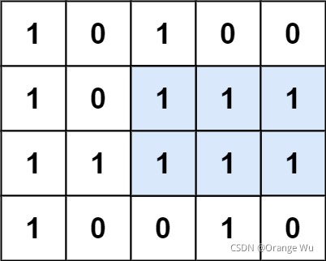

## [85. 最大矩形](https://leetcode-cn.com/problems/maximal-rectangle/)
### 题目
难度困难1055收藏分享切换为英文接收动态反馈

给定一个仅包含 `0` 和 `1` 、大小为 `rows x cols` 的二维二进制矩阵，找出只包含 `1` 的最大矩形，并返回其面积。

 

**示例 1：**




```
输入：matrix = [["1","0","1","0","0"],["1","0","1","1","1"],["1","1","1","1","1"],["1","0","0","1","0"]]
输出：6
解释：最大矩形如上图所示。
```

**示例 2：**

```
输入：matrix = []
输出：0
```

**示例 3：**

```
输入：matrix = [["0"]]
输出：0
```

**示例 4：**

```
输入：matrix = [["1"]]
输出：1
```

**示例 5：**

```
输入：matrix = [["0","0"]]
输出：0
```


### 题解

```C++
class Solution {
public:
    int largestRectangleArea(vector<int>& heights)
    {
        if (heights.empty()) {
            return 0;
        }
        // heights.insert(heights.begin(), 0);
        // heights.push_back(0);

        stack<int> st;
        st.push(0);

        int res = 0;
        for (int i = 1; i < heights.size(); ++i) {
            while (heights[i] < heights[st.top()]) {
                int h = heights[st.top()];
                st.pop();
                int w = i - st.top() - 1;
                res = max(res, h * w);
            }
            st.push(i);
        }
        return res;
    }

    int maximalRectangle(vector<vector<char>>& matrix) {
        if (matrix.empty()) {
            return 0;
        }
        vector<int> heights(matrix[0].size() + 2, 0);
        int res = 0;
        for (int i = 0; i < matrix.size(); ++i) {
            for (int j = 0; j < matrix[0].size(); ++j) {
                if (matrix[i][j] == '1') {
                    heights[j+1] += 1;
                } else {
                    heights[j+1] = 0;
                }
            }
            res = max(res, largestRectangleArea(heights));
        }
        return res;
    }
};
```