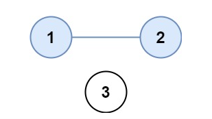
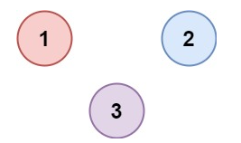

## 547. 省份数量

### 题目

### 题目

有 `n` 个城市，其中一些彼此相连，另一些没有相连。如果城市 `a` 与城市 `b` 直接相连，且城市 `b` 与城市 `c` 直接相连，那么城市 `a` 与城市 `c` 间接相连。

**省份** 是一组直接或间接相连的城市，组内不含其他没有相连的城市。

给你一个 `n x n` 的矩阵 `isConnected` ，其中 `isConnected[i][j] = 1` 表示第 `i` 个城市和第 `j` 个城市直接相连，而 `isConnected[i][j] = 0` 表示二者不直接相连。

返回矩阵中 **省份** 的数量。

 

**示例 1：**

 


```
输入：isConnected = [[1,1,0],[1,1,0],[0,0,1]]
输出：2
```

**示例 2：**

 


```
输入：isConnected = [[1,0,0],[0,1,0],[0,0,1]]
输出：3
```

 

**提示：**

- `1 <= n <= 200`
- `n == isConnected.length`
- `n == isConnected[i].length`
- `isConnected[i][j]` 为 `1` 或 `0`
- `isConnected[i][i] == 1`
- `isConnected[i][j] == isConnected[j][i]`


### 题解

```C++
class Solution {
public:
    int SearchRoot(int root, vector<int>& preArr)
    {
        int tmp;
        int son;
        son = root;

        // 寻找当前位置的根节点
        while (root != preArr[root]) {
            root = preArr[root];
        }

        // 路径压缩
        while (son != root) {
            tmp = preArr[son];
            preArr[son] = root;
            son = tmp;
        }
        return root;
    }

    int findCircleNum(vector<vector<int>>& isConnected) {
        int n = isConnected.size();
        if (n == 0) {
            return 0;
        }

        vector<int> preArr(n);
        for (int i = 0; i < n; ++i) {
            preArr[i] = i;
        }

        for (int i = 0; i < isConnected.size(); ++i) {
            for (int j = i + 1; j < n; ++j) {
                if (isConnected[i][j] == 0) {
                    continue;
                }
                int rootI = SearchRoot(i, preArr);
                int rootJ = SearchRoot(j, preArr);

                if (rootI == rootJ) {
                    continue;
                }
                preArr[rootJ] = rootI;
            }
        }

        int res = 0;
        for (int i = 0; i < n; ++i) {
            if (preArr[i] == i) {
                res++;
            }
        }

        return res;
    }
};

```

