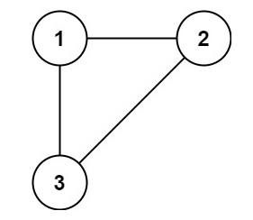
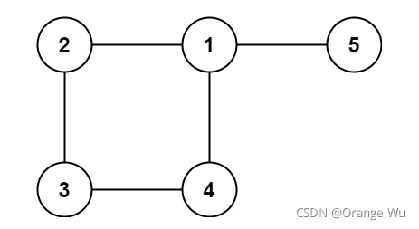

## [684. 冗余连接](https://leetcode-cn.com/problems/redundant-connection/)

### 题目

树可以看成是一个连通且 **无环** 的 **无向** 图。

给定往一棵 `n` 个节点 (节点值 `1～n`) 的树中添加一条边后的图。添加的边的两个顶点包含在 `1` 到 `n` 中间，且这条附加的边不属于树中已存在的边。图的信息记录于长度为 `n` 的二维数组 `edges` ，`edges[i] = [ai, bi]` 表示图中在 `ai` 和 `bi` 之间存在一条边。

请找出一条可以删去的边，删除后可使得剩余部分是一个有着 `n` 个节点的树。如果有多个答案，则返回数组 `edges` 中最后出现的边。

 

**示例 1：**

 


```
输入: edges = [[1,2], [1,3], [2,3]]
输出: [2,3]
```

**示例 2：**

 


```
输入: edges = [[1,2], [2,3], [3,4], [1,4], [1,5]]
输出: [1,4]
```

 

**提示:**

- `n == edges.length`
- `3 <= n <= 1000`
- `edges[i].length == 2`
- `1 <= ai < bi <= edges.length`
- `ai != bi`
- `edges` 中无重复元素
- 给定的图是连通的 

### 解答

```C++
#include <functional>
#include <iostream>
#include <vector>
#include <algorithm>
#include <stack>
#include <string>
#include <deque>
#include <set>

using namespace std;

int SearchRoot(int root, vector<int>& preArr)
{
    while (root != preArr[root]) {
        root = preArr[root];
    }
    return root;
}

vector<int> findRedundantConnection(vector<vector<int>>& edges) {
    int n = edges.size();
    vector<int> preArr(n + 1);
    for (int i = 0; i <= n; ++i) {
        preArr[i] = i;
    }
    for (auto e : edges) {
        int rootA = SearchRoot(e[0], preArr);
        int rootB = SearchRoot(e[1], preArr);

        if (rootA == rootB) {
            return e;
        }
        preArr[rootB] = rootA;
    }

    return {};
}


int main()
{
    vector<vector<int>> arr = {{1,4},{3,4},{1,3},{1,2},{4,5}};
    //{{1, 2}, {1, 3}, {2, 3}};{{1,2}, {2,3}, {3,4}, {1,4}, {1,5}}
    vector<int> res = findRedundantConnection(arr);
    for (auto i : res) {
        cout << i << " ";
    }
    cout<<endl;

    return 0;
}
```