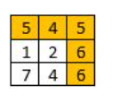
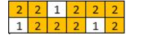

## 1102. 最高得分路径

### 题目
给你一个` R `行 `C `列的整数矩阵` A`。矩阵上的路径从` [0,0] `开始，在` [R-1,C-1] `结束。

路径沿四个基本方向（上、下、左、右）展开，从一个已访问单元格移动到任一相邻的未访问单元格。

路径的得分是该路径上的 最小 值。例如，路径` 8 → 4 → 5 → 9 `的值为` 4 `。

找出所有路径中得分 最高 的那条路径，返回其 得分。

示例 1：




> 输入：[[5,4,5],[1,2,6],[7,4,6]]
> 输出：4
> 解释： 
> 得分最高的路径用黄色突出显示。 

示例 2：




> 输入：[[2,2,1,2,2,2],[1,2,2,2,1,2]]
> 输出：2

> 示例 3：
>
> 输入：[[3,4,6,3,4],[0,2,1,1,7],[8,8,3,2,7],[3,2,4,9,8],[4,1,2,0,0],[4,6,5,4,3]]
> 输出：3


提示：

1.` 1 <= R, C <= 100`
2. `0 <= A[i][j] <= 10^9`

------------------------------------------------


### 解答

```C++
#include <iostream>
#include <vector>
#include <stack>
#include <queue>
#include <algorithm>

using namespace std;

struct Point {
    int x;
    int y;
    int val;
    Point(int mx, int my, int mVal) : x(mx), y(my), val(mVal) {}
};

struct Cmp {
    bool operator()(Point& a, Point& b)
    {
        return a.val < b.val;   // 大顶堆
    }
};

// 优先队列BFS
int MaximumMinimumPath0(vector<vector<int>>& A)
{
    int rows = A.size();
    int cols = A[0].size();
    int i = 0;
    int j = 0;
    int res = min(A[0][0], A[rows - 1][cols - 1]);
    priority_queue<Point, vector<Point>, Cmp> q;
    q.push(Point(i, j, A[j][j]));
    vector<vector<bool>> visited(rows, vector<bool>(cols, false));
    visited[0][0] = true;

    vector<vector<int>> dir = {{1, 0}, {-1, 0}, {0, 1}, {0, -1}};
    while (!q.empty()) {
        res = min(res, q.top().val);
        i = q.top().x;
        j = q.top().y;
        q.pop();

        if (i == rows - 1 && j == cols - 1) {
            return res;
        }

        for (auto d : dir) {
            int ni = i + d[0];
            int nj = j + d[1];
            if (ni >= 0 && ni < rows && nj >= 0 && nj < cols && !visited[ni][nj]) {
                q.push(Point(ni, nj, A[ni][nj]));
                visited[ni][nj] = true;
            }
        }
    }

    return res;
}

// 二分查找
bool FindPath(vector<vector<int>>& A, vector<vector<bool>> visited, int i, int j, int val)
{
    vector<vector<int>> dir = {{1, 0}, {-1, 0}, {0, 1}, {0, -1}};
    visited[i][j] = true;
    if (i == A.size() - 1 && j == A[0].size() - 1) {
        return true;
    }

    for (auto &d : dir) {
        int x = i + d[0];
        int y = j + d[1];

        if (x >= 0 && x < A.size() && y >= 0 && y < A[0].size() && !visited[x][y] && A[x][y] >= val) {
            if (FindPath(A, visited, x, y, val)) {
                return true;
            }
        }
    }
    return false;
}
int MaximumMinimumPath1(vector<vector<int>>& A)
{
    int m = A.size();
    int n = A[0].size();
    int l = 0;
    int r = min(A[0][0], A[m - 1][n - 1]);
    int res = r;

    while (l <= r) {
        vector<vector<bool>> visited(m, vector<bool>(n, false));
        int midVal = l + (r - l) / 2;
        if (FindPath(A, visited, 0, 0, midVal)) {
            res = midVal;
            l = midVal + 1;
        } else {
            r = midVal - 1;
        }
    }
    return res;
}


// 并查集
bool Cmp(Point& a, Point& b)
{
    return a.val > b.val;
}
int FindRoot(int root, vector<int>& preArr)
{
    while (root != preArr[root]) {
        root = preArr[root];
    }
    return root;
}
void UnionRoot(int x, int y, vector<int>& preArr)
{
    int root1 = FindRoot(x, preArr);
    int root2 = FindRoot(y, preArr);
    if (root1 != root2) {
        preArr[root1] = root2;
    }

}
int MaximumMinimumPath(vector<vector<int>>& A)
{
    int m = A.size();
    int n = A[0].size();
    vector<int> preArr(m * n, 0);
    vector<Point> pointVec;
    for (int i = 0; i < m; i++) {
        for (int j = 0; j < n; j++) {
            preArr[i * n + j] = i * n + j;
            pointVec.push_back(Point(i, j, A[i][j]));
        }
    }
    int res = min(A[0][0], A[m - 1][n - 1]);
    
    // 按照得分，从大到小排序，非常重要
    sort(pointVec.begin(), pointVec.end(), Cmp);

    vector<vector<bool>> visited(m, vector<bool>(n, false));
    visited[0][0] = true;
    visited[m - 1][n - 1] = true;

    vector<vector<int>> dir = {{1, 0}, {-1, 0}, {0, 1}, {0, -1}};
    int bId = 0;
    int eId = m * n - 1;

    for (auto p : pointVec) {
        res = min(res, p.val);
        int x = p.x;
        int y = p.y;
        int rootIndex = x * n + y;
        visited[x][y] = true;

        for (auto &d : dir) {
            int nx = x + d[0];
            int ny = y + d[1];
            // 找到大的已经访问过的
            if (nx >= 0 && nx < m && ny >= 0 && ny < n && visited[nx][ny]) {
                int rootNIndex = nx * n + ny;
                UnionRoot(rootIndex, rootNIndex, preArr);
            }
        }

        if (FindRoot(bId, preArr) == FindRoot(eId, preArr)) {
            break;
        }
    }
    return res;
}


int  main()
{
    vector<vector<int>> arr = {{5, 4, 5}, {1, 2, 6}, {7, 4, 6}};
    cout<<MaximumMinimumPath(arr)<<endl;

	return 0;

}


```