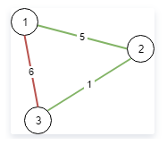
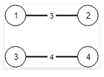

## 1135. 最低成本联通所有城市

### 题目

想象一下你是个城市基建规划者，地图上有 `N` 座城市，它们按以` 1` 到 `N` 的次序编号。

给你一些可连接的选项` conections`，其中每个选项 `conections[i] = [city1, city2, cost] `表示将城市` city1 `和城市` city2 `连接所要的成本。（连接是双向的，也就是说城市` city1 `和城市` city2 `相连也同样意味着城市` city2 `和城市` city1 `相连）。

返回使得每对城市间都存在将它们连接在一起的连通路径（可能长度为 1 的）最小成本。该最小成本应该是所用全部连接代价的综合。如果根据已知条件无法完成该项任务，则请你返回 -1。

**示例 1：**




> 输入：N = 3, conections = [[1,2,5],[1,3,6],[2,3,1]]
> 输出：6
> 解释：
> 选出任意 2 条边都可以连接所有城市，我们从中选取成本最小的 2 条。

**示例 2：**




> 输入：N = 4, conections = [[1,2,3],[3,4,4]]
> 输出：-1
> 解释： 
> 即使连通所有的边，也无法连接所有城市。


**提示：**

- `1 <= N <= 10000`
- `1 <= conections.length <= 10000`
- `1 <= conections[i][0], conections[i][1] <= N`
- `0 <= conections[i][2] <= 10^5`
- `conections[i][0] != conections[i][1]`


### 题解

```C++
#include <iostream>
#include <vector>
#include <stack>
#include <queue>
#include <algorithm>

using namespace std;

struct Connection {
    int A;
    int B;
    int cost;
    Connection(int mA, int mB, int mC) : A(mA), B(mB), cost(mC) {}
};

bool Cmp(Connection &A, Connection &B)
{
    return A.cost < B.cost;
}

int FindRoot(int root, vector<int>& preArr)
{
    while (root != preArr[root]) {
        root = preArr[root];
    }
    return root;
}

void UnionRoot(int a, int b, vector<int>& preArr)
{
    int rootA = FindRoot(a, preArr);
    int rootB = FindRoot(b, preArr);
    if (rootA != rootB) {
        preArr[rootB] = rootA;
    }
}

int minimumCost(int N, vector<vector<int>>& connections) {
    int n = connections.size();
    if (n < N - 1) {
        return -1;
    }
    vector<int> preArr(N + 1, 0);
    for (int i = 1; i <= N; i++) {
        preArr[i] = i;
    }
    vector<Connection> conVec;
    for (auto &c : connections) {
        conVec.push_back(Connection(c[0], c[1], c[2]));
    }
    sort(conVec.begin(), conVec.end(), Cmp);
    vector<bool> visited(N + 1, false);
    int res = 0;
    for (auto c : conVec) {
        if (visited[c.A] && visited[c.B] && FindRoot(c.A, preArr) == FindRoot(c.B, preArr)) {
            continue;
        }
        visited[c.A] = true;
        visited[c.B] = true;
        res += c.cost;
        UnionRoot(c.A, c.B, preArr);
    }

    int rootVal = FindRoot(1, preArr);
    for (int i = 2; i <= N; ++i) {
        if (rootVal != FindRoot(i, preArr)) {
            return -1;
        }
    }
    return res;
}


int  main()
{
    vector<vector<int>> arr = {{1,2,5},{1,3,6},{2,3,1}};

    cout << minimumCost(3, arr) << endl;


	return 0;

}

class Solution {
private:
    vector<int> fatherMap;
    vector<int> sizeMap;
    int getFather(int a){
        int fa = fatherMap[a];
        if(fa != a) fa = getFather(fa);
        // 把并查集变扁平
        fatherMap[a] = fa;
        return fa;
    }
    int merge(int a, int b){
        // 确认两个点为父节点，并且不相连
        int fa = getFather(a), fb = getFather(b);
        if(fa == fb) return sizeMap[fa];
        if(sizeMap[fa] > sizeMap[fb]) {
            // 当 b 所在的并查集元素较小时， 把 b 指向 a 所在的并查集
            sizeMap[fa] += sizeMap[fb];
            fatherMap[fb] = fa;
        }
        else {
            sizeMap[fb] += sizeMap[fa];
            fatherMap[fa] = fb;
        }
        return max(sizeMap[fa], sizeMap[fb]);
    }
public:
    int minimumCost(int N, vector<vector<int>>& conections) {
        if(N == 1) return 0;
        // 若城市个数大于 连接个数 + 1  不可能联通
        if(N > conections.size() + 1) return -1;

        // 初始化并查集
        fatherMap.resize(N), sizeMap.resize(N);
        for(int i=0; i<N; i++) {
            fatherMap[i] = i;
            sizeMap[i] = 1;
        }

        int res = 0, total = 0;
        // 按照每条连接的权重排序
        sort(conections.begin(), conections.end(),
            [](vector<int>& a, vector<int>& b){ return a[2] < b[2]; });

        for(int i=0; i<conections.size(); i++){
            int fa = getFather(conections[i][0]-1), fb = getFather(conections[i][1]-1);
            // 已经属于一个并查集了，不需要加入此连接
            if(fa == fb) continue;
            total = merge(fa, fb);
            // 加上当前权重
            res += conections[i][2];
            // 通过返回值，可以提前终止迭代过程
            if(total == N) return res;
        }
        return -1;
    }
};
```